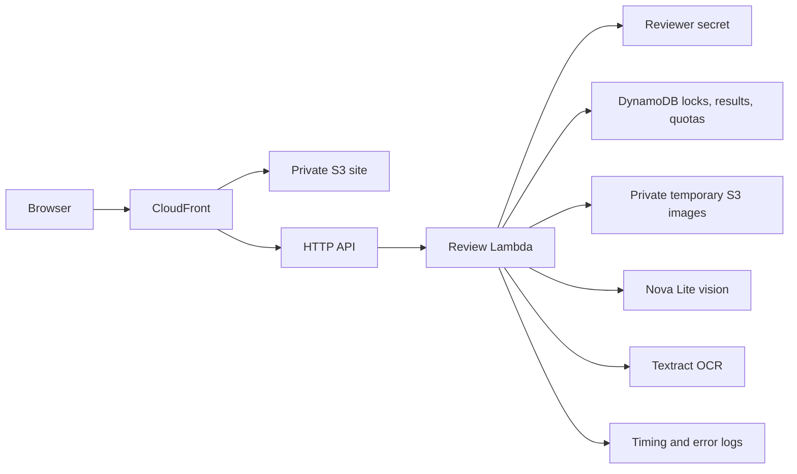

# Architecture

All reviewer-facing resources are served from one CloudFront hostname. No third-party font/CDN/AI browser dependency. The frontend API origin is same-origin; CORS is not enabled. A JSON content type and custom request header prevent browser cross-origin simple requests. Live processing requires a signed, expiring cookie.

The Lambda validates the request schema, decodes the actual image, corrects EXIF orientation and strips metadata. Its SHA-256 idempotency key includes prepared bytes, expected values and pipeline version. Conditional DynamoDB writes claim a 60-second processing lease; completed results are reused only in the same session and within retention. Atomic counters reserve paid-call allowance before extraction.

Nova and Textract run in parallel. Nova receives only the image and extraction instructions, never application expectations. Model JSON is validated. Deterministic rules compare the result against expected values. OCR corroboration and line confidence gate automated matches; line geometry supports evidence highlighting. Warning formatting is always deferred to a human.

The browser queue runs at most two requests simultaneously. Each item has an ID, state, queue duration and processing duration. Partial failure is isolated. One automatic retry applies to declared transient failures. A closed tab stops queued work; already accepted requests may complete and be reused on resubmission. SQS was omitted to keep the prototype small; durable background batches are a documented future improvement.

The API Lambda has four reserved concurrent executions, 1 GB memory and a 28-second timeout. AWS model calls use a 22-second abort signal and no SDK retries. The browser times out after 32 seconds. Logs exclude image text. DynamoDB TTL and S3 lifecycle provide asynchronous cleanup.
